# **APLICACIÓN DISTRIBUIDA SEGURA EN TODOS SUS FRENTES**

Aplicación desplegada en AWS usando varias instancias EC2. La aplicación cuenta con un servidor web el cual implementa HTTPS para su conexión con el browser, a su vez, este se conecta con una API REST que únicamente devuelve "Hello World". Esta última conexión también se realiza mediante https. Se implementó un sistema de login para asegurar integridad, autorización y autenticación. La aplicación respoeta la siguiente arquitectura.


## Getting Started

These instructions will get you a copy of the project up and running on your local machine for development and testing purposes.

### Prerequisites

What things you need to install the software and how to install them
Para hacer uso de la aplicación necesitarás tener instalado el siguiente software
- [JDK](https://docs.aws.amazon.com/es_es/corretto/latest/corretto-8-ug/amazon-linux-install.html) version 1.8.x
- [Maven](https://maven.apache.org/download.cgi)
- [Git](https://git-scm.com/downloads)
- [MongoDB](https://docs.aws.amazon.com/dms/latest/sbs/chap-mongodb2documentdb.02.html)


### Installing

Para obtener una copia de la aplicación deberás clonar este repositorio. Ingresa la siguiente instrucción en Git Bash:

```
git clone https://github.com/stefania5964/taller6.git
```

Luego, ejecuta el siguiente comando para compilar y empaquetar todo el proyecto:

```
mvn package
```


## **Diseño**
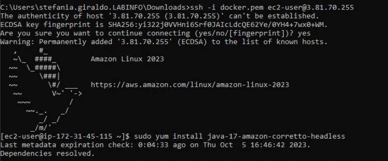
### ServerWeb
El servidor web está creado con el microframework web [Spark](https://sparkjava.com/). La instrucción GET para la ruta "/" hace la conexión con el servidor remoto. Para esto, el servidor tiene implementada la opción de seguridad en la que tiene su certificado en el KeyStore y al hacer la conexión HTTPS cambia el contexto SSL haciento que el TrustStore contenga el certificado del servidor con el que se quiera hacer la conexión, en este caso "Securespark".

### Securespark
el servidor remoto también está creado con [Spark](https://sparkjava.com/).Este está configurado para funcionar únicamente con conexiones HTTPS y retorna la cadena "Hello World ".
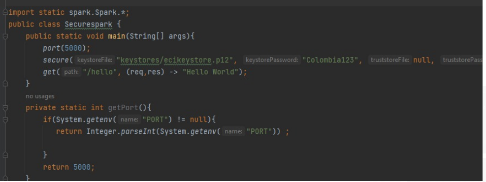

## **Implementación**
Todas las instacias EC2 deberán tener [JDK](https://docs.aws.amazon.com/es_es/corretto/latest/corretto-8-ug/amazon-linux-install.html) version 1.8.x para Amazon Linux instalado.
Creamos la carpeta donde van a ir los certificados
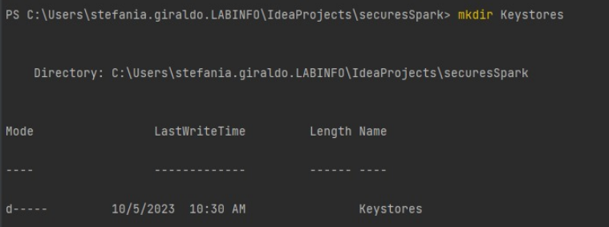
subimos  los arcgivos classes y dependency en aws
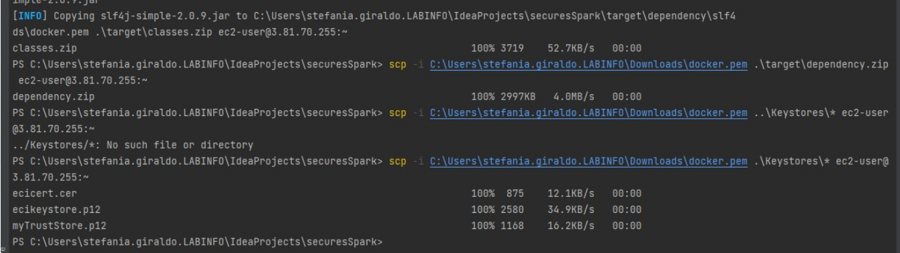
luego los descomprimimos, ya que estaba en .zip
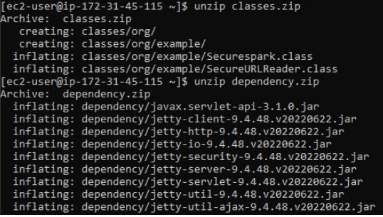
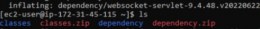
Creamos los certificados para cada servidor indicando el nombre y apellido como la dirección de DNS pública.

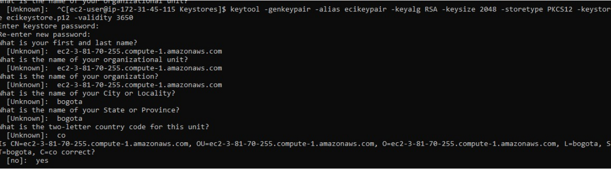

Exportamos el certificado del servidor remoto (apikeypairAWS) para importarlo en el TrustStore del servidor web.
Lo importamos.
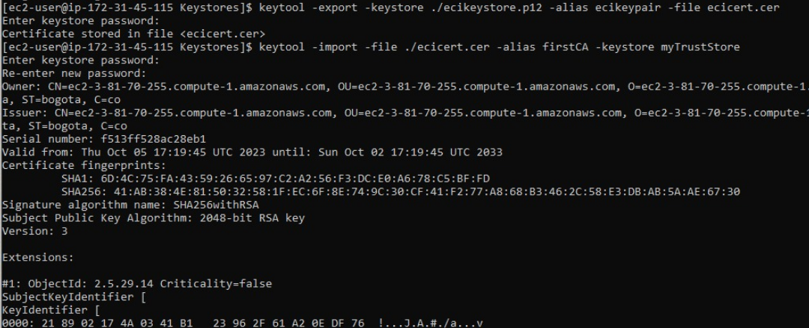
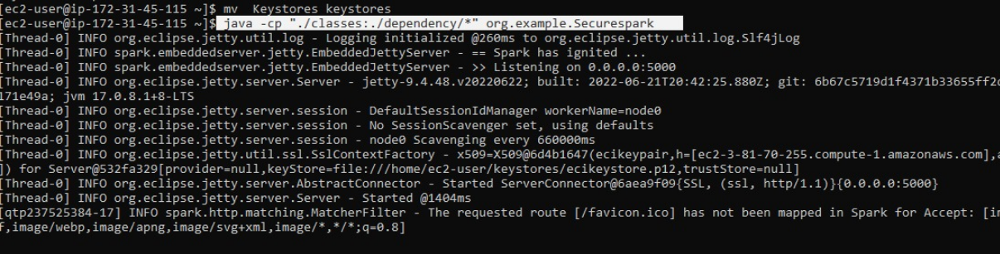
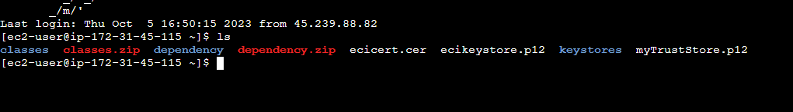
luego vemos en la pagina lo que noes muestra
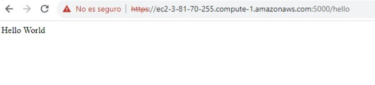
cremos el segundo servidor habilitando el nuevo puerto.
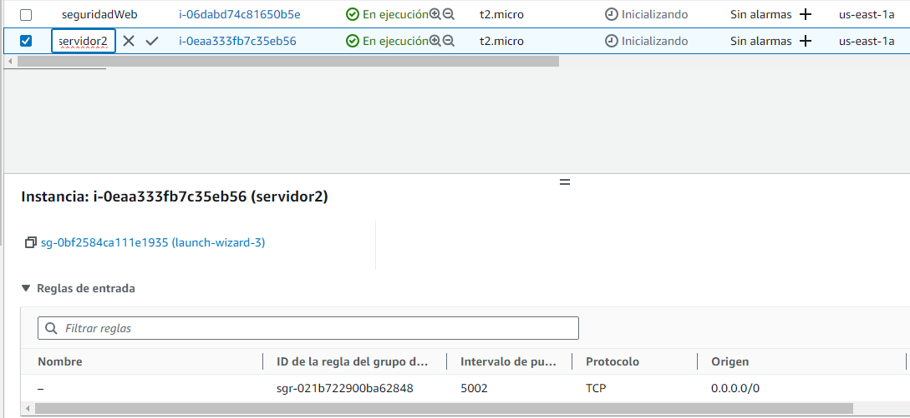
Enviamos los programas con SCP a los servidores y los corremos con ```java -cp``` y listo.


## **Implementación login**


El programa revisa que el usuario se encuentre en la base y encripta la contraseña dada para compararla
con la guardada, luego lo redirige haciendo que se establezca la conexión con Securespark.
Por último se restringe el acceso a cualquier recurso si el usuario no está autenticado.

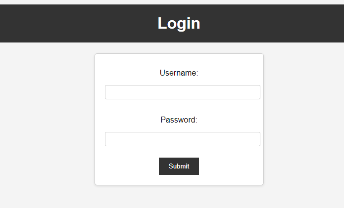
## **Escalabilidad**
### **Certificados SSL:**
Cada servidor (instancia) debe tener su propio certificado SSL y clave privada. Esto garantiza que cada servidor tenga su identidad única y que las comunicaciones entre ellos sean seguras.

### **Variables de Entorno:**

Define variables de entorno para configurar las rutas de los archivos de certificados y claves privadas en cada instancia de servidor. Esto permite que cada servidor se configure con sus propios certificados sin necesidad de modificar el código fuente.


## Built With

* [Dropwizard](http://www.dropwizard.io/1.0.2/docs/) - The web framework used
* [Maven](https://maven.apache.org/) - Dependency Management
* [ROME](https://rometools.github.io/rome/) - Used to generate RSS Feeds


